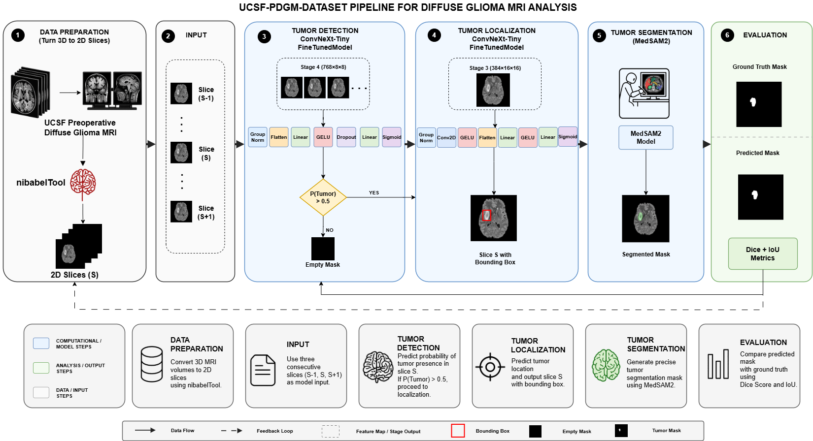

# BrainAgent

**Multi-Agent Fusion for Glioma Report Generation from Multi-Sequence MRI**

This repository hosts the code and the **Technical Implementation and Reproducibility Details** document for the article of the same name, submitted to *IEEE Transactions on Medical Imaging*. IEEE TMI does not accept appendix-style supplementary documents, so it is published here instead. Every cross-reference in the paper of the form **"Appendix A-B"**, **"Appendix B-C"** or **"Appendix C-G"** points into [`appendix.pdf`](appendix.pdf) in this repository.

> 📄 **[Technical Implementation and Reproducibility Details →](appendix.pdf)** (28 pages)



*The segmentation pipeline that grounds every agent: a ConvNeXt-Tiny detector on 2.5D input classifies each slice for tumour presence and regresses a bounding box; the box is passed as the sole prompt to MedSAM2; the three per-plane masks are fused by majority voting (Appendix C-G, Fig. 9).*

---

## What BrainAgent is

BrainAgent turns a four-sequence brain MRI study (T1, T1c, T2, FLAIR) into a structured radiology report. Rather than compressing the whole volume into one forward pass, it decomposes the problem the way the anatomy is actually read:

- **12 modality–view agents** — one per (sequence × plane) combination — each analyse their own assembled image batches;
- **3 view-level consolidation agents** — one per anatomical plane — reconcile the four sequences within their view;
- **1 master orchestrator** synthesises the three planes into the final report, resolving cross-planar disagreement with an explicit bias toward the axial view.

Every agent is grounded in a quantitative imaging pipeline — N4 bias-field correction, SyN/ANTs registration to MNI-152, ConvNextLocator + MedSAM2 tumour segmentation, Harvard-Oxford and Pauli atlas localisation, and BraTS-convention volumetry — so that textual claims trace back to measurable image findings.

The system was evaluated on three cohorts under two independent protocols: an eleven-category **LLM-as-judge** finding-level F1, and a six-criterion **human rubric** with critical-error flags. Every evaluated case was read by a human expert; five blinded readers contributed **1137 report-level evaluations**.

---

## What is in the document

`appendix.pdf` is organised in three appendices, lettered to match the paper's cross-references exactly.

### Appendix A — Methods details

| § | Contents |
|---|---|
| **A-A** | Extended related work on text-native language models in neuroradiology, and the lineage of clinically oriented report-generation metrics |
| **A-B** | **Provenance of every pretrained component** — which models are third-party checkpoints used as released, which are population atlases, and which were trained by us, together with the relationship between their training data and the evaluation cohorts |
| **A-C** | Cohort heterogeneity, the full ten-module cascade, input handling and DICOM conversion, evaluator assignment |
| **A-D** | **Authoring protocol for the RHUH-GBM reference reports** — readers, information available to them, reporting procedure, audit trail, and three stated limitations |
| **A-E** | Imaging pipeline details: RAS+ reorientation, N4, isotropic resampling, volumetry, centroid and hemisphere determination, registration transforms |
| **A-F** | Model-agnostic architecture, view-level consolidation worked example, structured-output validation, configuration, performance monitoring, coordinate conventions |
| **A-G** | Protocol administration and the complementarity of the two evaluation instruments |

### Appendix B — Extended results

| § | Contents |
|---|---|
| **B-A** | In-house cohort, LLM-as-judge: micro- vs macro-averaging, per-patient F1 distribution, three-regime per-category analysis (**Fig. 5**) |
| **B-B** | In-house cohort, human rubric: per-criterion averages, per-evaluator decomposition, composite-score distribution, per-rater critical-flag breakdown, inter-rater agreement, and where the two protocols agree and diverge (**Fig. 6**) |
| **B-C** | RHUH-GBM per-category performance and the cross-dataset comparison (**Fig. 7**) |
| **B-D** | UCSF-PDGM: rater coverage, per-criterion, per-evaluator, score distribution, critical flags, inter-rater agreement (**Fig. 8**) |
| **B-E** | Extended conclusion |
| **B-F** | Author contributions |

### Appendix C — Reproducibility record

| § | Contents |
|---|---|
| **C-A** | Three-tier multi-agent topology and the axial-reference consolidation rule |
| **C-B** | Model inventory — generation backbone, judge, and every supporting image-analysis model |
| **C-C** | Per-tier generation and sampling settings |
| **C-D** | **Complete report-generation agent prompts**, verbatim |
| **C-E** | **Complete orchestrator prompts**, verbatim |
| **C-F** | **The full LLM-as-judge prompt** and the finding-level F1 definition |
| **C-G** | Computer-vision hyperparameters: ConvNextLocator, MedSAM2, preprocessing, skull stripping, registration and atlases, tumour metrics (**Fig. 9**) |
| **C-H** | Reproducibility notes |

Figure and table numbering continues that of the paper: the paper ends at Fig. 4 and Table I, so **Figs. 5–9** and **Tables II–IX** belong to the appendix. Figs. 5 and 6 also appear in the paper as Figs. 3 and 4; the appendix reproduces them so its analyses are self-contained.

---

## Released evaluation artifacts

Beyond this document, the following are released so that every number in the paper can be recomputed:

- the **40 expert-authored RHUH-GBM reference reports** and the protocol under which they were written;
- the **1137 per-case human rubric score sheets**, with free-text justifications and critical-error flags;
- the **per-case finding-level judge inventories and counts**.

**Not released:** the in-house teleradiology reference reports. These are original clinical documents subject to a data-sharing agreement and patient-confidentiality obligations. The imaging cohorts themselves are third-party: RHUH-GBM and UCSF-PDGM are distributed through The Cancer Imaging Archive under their originating institutions' policies.

A trial view of how the human evaluation is carried out is available at **https://www.mednextsolutions.com/trial**.

---

## Repository layout

```
appendix.pdf      Technical Implementation and Reproducibility Details (A, B, C)
Appendix.md       long-form markdown rendering of the reproducibility record
Segmentation.png  segmentation pipeline overview
LICENSE
```

The code implementation will be added on acceptance.

---

## Citing

```bibtex
@article{elboardy2026brainagent,
  author  = {Elboardy, Ahmed T. and Elshaer, Ziad and Ahmed, Sameh and
             Shehaby, Ibrahim and Raslan, Ahmed S. E. and Elfatairy, Kareem K. and
             Tawfik, Nermeen A. and {al-Shatouri}, Mohammad and Khoriba, Ghada and
             Mabrok, Mohamed A. and Rashed, Essam A.},
  title   = {BrainAgent: Multi-Agent Fusion for Glioma Report Generation from
             Multi-Sequence MRI},
  journal = {IEEE Transactions on Medical Imaging},
  note    = {Under review},
  year    = {2026}
}
```

### Related work from the same group

- Elboardy, Khoriba, al-Shatouri, Mousa & Rashed, *Benchmarking vision-language models for brain cancer diagnosis using multisequence MRI*, **Informatics in Medicine Unlocked** 58:101692, 2025. [doi:10.1016/j.imu.2025.101692](https://doi.org/10.1016/j.imu.2025.101692)
- Elboardy, Khoriba & Rashed, *Medical AI Consensus: A Multi-Agent Framework for Radiology Report Generation and Evaluation*, **arXiv:2509.17353**, 2025. [arXiv](https://arxiv.org/abs/2509.17353)

---

## Contact

Corresponding author: **Essam A. Rashed** — rashed@gsis.u-hyogo.ac.jp
Graduate School of Information Science, University of Hyogo, Kobe, Japan
